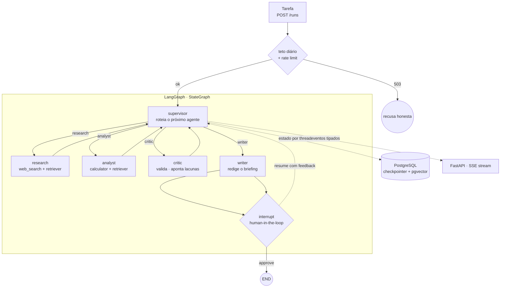

# Arquitetura

Pauta decompõe uma pergunta analítica em etapas, delega cada etapa a um agente
especializado, valida o resultado com um crítico e redige um briefing. O grafo
tem 5 nós. Não vai crescer sem número de eval que justifique.

## O grafo

O supervisor decide o próximo passo a cada ciclo. O crítico pode devolver o
trabalho para research ou analyst apontando a lacuna. O writer só roda depois de
crítico aprovado, ou do limite de iterações, ou do estouro de orçamento. Antes do
END, um interrupt congela o grafo e espera o humano.

## Decisões

### ADR 001: supervisor com roteamento dinâmico, não pipeline fixo

**Contexto.** Tarefas analíticas variam. Umas precisam de três ciclos de pesquisa,
outras vão direto para cálculo.

**Decisão.** O supervisor é um LLM com output estruturado que escolhe o próximo
agente e justifica a escolha em uma frase.

**Consequência.** Uma chamada de LLM a mais por ciclo. Em troca, o grafo se adapta
à tarefa em vez de gastar etapas inúteis. A justificativa vai no stream de eventos.

### ADR 002: crítico com loop finito

**Contexto.** Validação cruzada separa rascunho de briefing. Loop de LLM sem teto é
conta de API sem teto.

**Decisão.** `MAX_CRITIC_LOOPS = 2`. Depois disso o writer redige com as ressalvas
registradas no próprio texto.

**Consequência.** O relatório pode sair dizendo "não foi possível validar X". Isso é
o comportamento desejado, não uma falha.

### ADR 003: memória via checkpointer do LangGraph, não banco caseiro

**Contexto.** O sistema precisa retomar execução por thread e pausar para um humano.

**Decisão.** `PostgresSaver` oficial em produção, `MemorySaver` em teste.

**Consequência.** Checkpoint por `thread_id`, retomada e o mecanismo de
interrupt/resume vêm do framework. O que o checkpointer faz por nós está declarado
no README, porque saber o que o framework abstrai importa tanto quanto usá-lo.

### ADR 004: orçamento como cidadão de primeira classe, em três camadas

**Contexto.** Agentes multiplicam chamadas. Uma tarefa ruim pode custar 100 vezes o
esperado, e uma demo pública pode custar mais que isso.

**Decisão.** Três camadas. Camada 1: contador de tokens no estado, checado no
supervisor, estourou vai direto para o writer. Camada 2: teto global diário em
Postgres, checado no handler HTTP, estourou devolve 503. Camada 3: rate limit por
IP na demo pública.

**Consequência.** O custo aparece no payload de resposta e no log desde o primeiro
commit. O 503 traz mensagem honesta, com instrução de clonar e rodar local.

### ADR 005: vetores em pgvector, não em Chroma embedded

**Contexto.** O compose já sobe Postgres para o checkpointer. Adicionar Chroma
introduziria um segundo mecanismo de persistência no mesmo diagrama.

**Opções.** Chroma embedded tem setup zero e isola o índice do banco de estado, ao
custo de mais um volume no compose. pgvector reusa o Postgres que já existe, ao
custo de habilitar a extensão e escrever a query de similaridade.

**Decisão.** pgvector, via `langchain-postgres`. A imagem do compose passa a ser
`pgvector/pgvector`, e a extensão é criada na inicialização do banco.

**Consequência.** Um storage no diagrama, não dois. O teste do retriever passa a
precisar de Postgres, então ele fica marcado e é pulado quando não há banco. O
embedding é `text-embedding-3-small`, declarado em `EMBEDDING_MODEL`, nunca
implícito no código.

### ADR 006: recuperação explícita, nunca automática

**Contexto.** `POST /runs` responde 201 na hora e executa em background. Se o
processo cair, a run fica com checkpoint válido e sem executor.

**Decisão.** No startup, a app varre threads em estado não terminal e as marca como
`orphaned`. Não retoma sozinha. A retomada é um POST explícito.

**Consequência.** `orphaned` existe no contrato da API e aparece em
`GET /runs?status=orphaned`. Religar o servidor não gasta token de ninguém.

### ADR 007: modelo é configuração por papel, não constante global

**Contexto.** Research e writer fazem recuperação e redação. Supervisor e crítico
fazem raciocínio. Modelo barato em tudo sabota o experimento central do projeto,
porque crítico fraco tende a carimbar `verdict: ok`.

**Decisão.** Toda instanciação passa por `get_model(role)`, com `init_chat_model` e
variáveis de ambiente. Nenhum default no código.

**Consequência.** Trocar de provider é editar `.env`. O eval ganha um terceiro eixo,
crítico barato contra crítico melhor.

## APIs do LangGraph que este projeto usa

Verificadas contra `langgraph 1.2.11`, a versão do lock. Se o pin subir, confira de
novo antes de confiar nesta tabela.

| API | Assinatura real | Uso aqui |
|---|---|---|
| `StateGraph.add_node` | `add_node(node, action=None, *, retry_policy=None, timeout=None, error_handler=None, defer=False, ...)` | timeout e retry por nó, sem wrapper manual |
| `RetryPolicy` | `NamedTuple(initial_interval, backoff_factor, max_interval, max_attempts, jitter, retry_on)` | `max_attempts` e um `retry_on` próprio |
| `RunControl` | `langgraph.runtime.RunControl`, com `request_drain(reason)` e `drain_requested` | drain cooperativo, teste de durabilidade da semana 2 |
| `CompiledStateGraph.stream` | aceita `control=`, `durability=` e `version="v1" \| "v2"` | stream tipado que vira SSE |

O `default_retry_on` do LangGraph retenta 5xx e recusa `ValueError` e `TypeError`.
Ele não retenta 429. Como rate limit precisa ser retentado e erro de validação de
schema não, este projeto passa o próprio predicado em `retry_on`.
