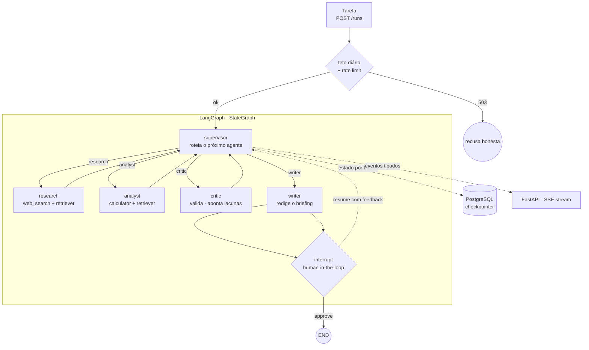

# Dossiê de Projeto — Pauta

**Briefings analíticos multi-agente com LangGraph**
Versão 1.1 · 2026-09-02 · Autor: Bruno
Origem: agente COACH do Cortex (`memory/agents/forge/forge_projects.json`, rank 1 de 4), sob o codinome interno AgentFlow.

> **Nota de nome.** O projeto nasceu como *AgentFlow* e foi renomeado para **Pauta** antes do primeiro commit. `AgentFlow` colide com pelo menos oito repositórios públicos, entre eles um framework de produção no PyPI e um projeto acadêmico com paper aceito em workshop do NeurIPS 2025, cujos quatro módulos (Planner, Executor, Verifier, Generator) são quase idênticos aos agentes daqui. Disputar esse nome seria ficar invisível no próprio portfólio.
>
> **Pauta** é a palavra da redação brasileira para o briefing de uma reportagem: a pergunta, as fontes a checar e quem revisa. É exatamente o que este sistema produz.

---

## 1. Sumário executivo

Motor de orquestração multi-agente que decompõe perguntas complexas de análise em etapas executadas por agentes especializados (pesquisador, analista, crítico, redator), coordenados por um supervisor com roteamento dinâmico, loop de crítica controlado, human-in-the-loop e memória persistente entre sessões. Exposto via API FastAPI com streaming da execução em tempo real.

**Por que este projeto e não outro:** é a skill mais citada em vagas de AI Engineer no momento (LangGraph, orquestração de agentes) aplicada ao domínio que você conhece por dentro. Um engenheiro puro monta o grafo mas não sabe o que é um briefing analítico de verdade, com quais perguntas ele morre, por que revisão cruzada existe em todo processo editorial sério. Você viveu analytics e produção de conteúdo: sabe que análise boa não é uma resposta, é uma cadeia coletar → processar → criticar → redigir. Este projeto transforma essa vivência em arquitetura, e o nome carrega isso.

**Diferença para o Mentor AI G4 (para os dois não parecerem o mesmo):** o Mentor é um problema de **recuperação** (achar a informação certa e citar). O Pauta é um problema de **coordenação** (decompor, delegar, validar, iterar). No README dos dois, deixe essa distinção explícita. São camadas diferentes da stack de AI Engineer e o portfólio conta a história dos dois juntos.

**Entregável final (o que vai no portfolio):**

| Peça | Forma |
|---|---|
| Repo público | GitHub `pauta`, arquitetura documentada, testes, CI verde |
| Demo | API rodando + página mínima mostrando o grafo executando em streaming |
| Vídeo | 2 min, demo real incluindo o momento human-in-the-loop |
| Post LinkedIn | Técnico, com números medidos (com vs. sem crítico) |

**Subtítulo canônico do repo (usar igual no GitHub, no README e no LinkedIn):**

```
Multi-agent analytical briefings with LangGraph: dynamic supervision,
a bounded critic loop, human-in-the-loop interrupts and a token budget.
```

**Prazo:** 3 semanas em ritmo de projeto paralelo.

---

## 2. O problema

Perguntas analíticas de valor não cabem numa chain linear. "Vale a pena migrar nossa infra de X para Y?" exige: coletar dados de fontes distintas, processar/calcular, validar consistência, redigir uma conclusão. Um pipeline LLM linear (prompt → resposta) falha em três pontos:

1. **Não decomposta, a tarefa vira um prompt gigante** e prompt gigante é loteria. Cada sub-tarefa (achar dado, calcular, validar) tem dificuldade e ferramenta própria.
2. **Sem crítica, sem qualidade.** Uma resposta gerada uma vez, sem validação cruzada, é um rascunho entregue como relatório. Todo processo editorial sério tem revisor; todo pipeline LLM sério tem crítico.
3. **Sem memória, sem continuidade.** A execução morre com o processo. Retomar uma análise na segunda-feira com o contexto da sexta, ou pausar para um humano aprovar uma etapa crítica, exige estado persistente.

### Personas

**Analista (usuário primário)**
Tem uma pergunta de negócio que exige múltiplas etapas. Quer um briefing curto, com fontes, e quer ver o raciocínio acontecendo, não uma caixa preta que cospe resposta em 90 segundos.

**Revisor humano (papel que você formaliza)**
Aprova ou redireciona etapas críticas via interrupt. É o controle de qualidade no meio do pipeline, não no fim. Essa peça é o que diferencia este projeto de todo "autonomous agent" de tutorial: você trata a intervenção humana como feature de arquitetura, não como fallback.

---

## 3. Escopo da v1

### Está dentro

- Grafo LangGraph: supervisor (roteamento dinâmico) + 4 agentes (research, analyst, critic, writer).
- 3 tools: busca web (Tavily), retriever RAG sobre documentos locais, calculator.
- Loop de crítica controlado (crítico pode mandar refazer, com limite de iterações).
- Human-in-the-loop: interrupt antes da resposta final, com retomada via API.
- Memória persistente: Postgres checkpointer, execução retomável por thread, com recuperação explícita de runs órfãs.
- Guardrails de custo em três camadas: orçamento por execução, teto global diário, rate limit na API pública.
- Modelo configurável por papel (tier econômico para trabalho, tier melhor para roteamento e crítica).
- API FastAPI com streaming SSE da execução (eventos por nó, tool calls, tokens, erros).
- Golden set de tarefas + suite de avaliação com métricas de agente e protocolo estatístico (repetições, desvio).
- Docker compose: API + Postgres num comando.

### Está fora da v1 (declare isso no README)

- Multi-tenant, autenticação, usuários.
- Execução distribuída/filas.
- Observabilidade completa com tracing e evals contínuos (é o próximo projeto do portfólio; aqui há apenas trace opcional por variável de ambiente, para desenvolvimento).
- Voice, UI rica, agentes que criam sub-agentes dinamicamente.
- Fine-tuning.

Escopo fechado é sinal de senioridade. E aqui tem um bônus: os itens "fora" mapeiam os próximos projetos do portfólio. O README do Pauta aponta para os próximos, e o portfólio vira um plano, não uma coleção.

---

## 4. Arquitetura



O supervisor decide o próximo passo a cada ciclo (conditional edges). O crítico pode mandar de volta para research ou analyst apontando a lacuna. O writer só roda depois de crítico aprovado, ou do limite de iterações, ou do estouro de orçamento. Antes do END, um interrupt congela o grafo e espera o humano.

### Decisões de arquitetura (registre como ADRs em `ARCHITECTURE.md`)

**ADR 001 — Supervisor com roteamento dinâmico, não pipeline fixo.**
Tarefas analíticas variam: umas precisam de 3 ciclos de pesquisa, outras vão direto para cálculo. Pipeline fixo desperdiça ciclos ou força etapas inúteis. O supervisor é um LLM com output estruturado que escolhe o próximo agente e justifica. Custo: uma chamada extra por ciclo. Benefício: o grafo se adapta à tarefa. Essa é a definição da skill "multi-agent orchestration" que as vagas pedem.

**ADR 002 — Crítico com loop finito.**
Validação cruzada é o que separa rascunho de briefing. Mas loop de LLM sem teto é conta de API infinita. Solução: `MAX_CRITIC_LOOPS = 2`, e depois disso o writer redige com as ressalvas registradas no próprio texto ("não foi possível validar X"). O relatório honesto sobre o que não validou é mais impressionante em entrevista do que a resposta perfeita.

**ADR 003 — Memória via checkpointer do LangGraph, não banco caseiro.**
O `PostgresSaver` oficial dá checkpoint por `thread_id`, retomada de execução e o mecanismo de interrupt/resume do human-in-the-loop de graça. Escrever isso na mão é reinventar o que o framework resolveu, e em entrevista você quer explicar as decisões acima do grafo, não seu ORM de mensagens. Registre no README o que o checkpointer faz por você: saber o que o framework abstrai é tão importante quanto saber usar. `MemorySaver` fica só para teste.

**ADR 004 — Orçamento como cidadão de primeira classe, em três camadas.**
Agentes multiplicam chamadas (supervisor + N ciclos + crítica + redação). Sem guardrail, uma tarefa ruim pode custar 100x o esperado, e uma demo pública pode custar muito mais que isso. Camada 1: contador de tokens no estado, checado no supervisor, estourou vai direto para o writer. Camada 2: teto global diário em Postgres, checado no handler HTTP, estourou devolve 503. Camada 3: rate limit por IP na demo pública. "Agentes com budget" é um parágrafo inteiro de post técnico.

**ADR 005 — Vetores: Chroma embedded vs pgvector.**
*Contexto:* o compose já sobe Postgres para o checkpointer; adicionar Chroma introduz um segundo mecanismo de persistência.
*Opção A, Chroma embedded:* setup zero, sem migração, isolado do banco de estado. Custo: mais um volume no compose e uma resposta fraca para "por que dois storages".
*Opção B, pgvector:* uma dependência a menos no diagrama e o argumento "eu já tinha Postgres e reusei". Custo: extensão a habilitar e queries de similaridade na sua mão.
*Decisão:* **[preencha antes do commit 1]**. *Consequência:* [uma frase].
Qualquer lado está certo. O que não pode é a ADR não existir: é a pergunta que o entrevistador faz olhando seu `docker-compose.yml`.

**ADR 006 — Recuperação explícita, nunca automática.**
`POST /runs` responde 201 na hora e executa em background. Se o processo cair, a run fica com checkpoint válido e sem executor. No startup, a app varre threads em estado não terminal e as marca como `orphaned`, mas **não** retoma sozinha: religar o servidor não pode gastar tokens sem alguém pedir. A retomada é um POST explícito. Consequência: o estado `orphaned` existe no contrato da API e aparece no `GET /runs?status=orphaned`.

**ADR 007 — Modelo é configuração por papel, não constante global.**
Research e writer são recuperação e redação; supervisor e crítico são raciocínio. Usar o mesmo modelo barato em tudo sabota o experimento central do projeto, porque crítico fraco tende a carimbar `verdict: ok` e a tabela com/sem crítico mede ruído. Toda instanciação passa por `get_model(role)` com `init_chat_model`, e os modelos vêm de variáveis de ambiente. Consequência boa: trocar de provider é `.env`, e o eval ganha um terceiro eixo (crítico barato vs crítico melhor).

---

## 5. Stack

| Camada | Escolha | Versão-alvo | Por quê |
|---|---|---|---|
| Linguagem | Python | 3.11+ | Baseline do mercado |
| Orquestração | LangGraph | `1.2.*`, lock comitado | StateGraph, checkpointer, interrupt, timeout e retry por nó, drain cooperativo, streaming tipado |
| Componentes | LangChain | `1.*` com `langchain-core 1.4.*` | `@tool`, loaders, `init_chat_model`; só o essencial |
| LLM (worker) | tier econômico atual, via `MODEL_WORKER` | env | research e writer não exigem raciocínio profundo |
| LLM (router e critic) | tier intermediário, via `MODEL_ROUTER` / `MODEL_CRITIC` | env | roteamento estruturado e crítica cruzada degradam muito em modelo pequeno |
| Embeddings | via `EMBEDDING_MODEL` | env | declarado e versionado, nunca implícito |
| Busca web | Tavily API | tier grátis | Feita para agentes, retorna trechos limpos |
| Retriever local | Chroma embedded **ou** pgvector | ver ADR 005 | Docs abertas em `samples/` |
| Memória | PostgreSQL + `langgraph-checkpoint-postgres` | pin exato | Checkpoint por thread, interrupt/resume |
| API | FastAPI | `0.11*` | SSE + Swagger automático |
| UI demo | página HTML mínima (um arquivo) | — | O protagonista é o stream de eventos; não gaste tempo em frontend |
| Avaliação | pytest + suite própria + LLM-as-judge de provider distinto | — | Métricas de agente que libs de RAG não cobrem |
| Ferramentas | `uv`, `ruff`, `mypy` | — | O estado é `TypedDict` com reducers: rodar sem type checker desperdiça a única parte que o compilador protege |
| Container | Docker + docker-compose | — | API + Postgres num comando |
| CI | GitHub Actions | — | Unit no push, eval no nightly |

### Sobre versões, com cuidado

LangChain e LangGraph chegaram ao 1.0 juntos em 22/10/2025 e assumiram versionamento semântico, sem breaking changes até o 2.0. Em meados de 2026 o `langchain-core` está na linha 1.4.x e o LangGraph na 1.2.x. **Não misture `langchain 0.3.x` com `langgraph 1.x`**: são gerações diferentes e brigam na resolução do `langchain-core`. Pin da minor nos dois e lock comitado.

Confira as assinaturas exatas de `add_node(timeout=..., retry=...)`, do `RunControl.request_drain()` e do `stream(version="v2")` contra a versão que você pinar; as features estão nos releases 1.2, os nomes dos parâmetros podem ter variado.

### Sobre modelos

Não pine um modelo específico neste documento. As linhas econômicas de 2026 já são outras (a família GPT-5.6 tem tier econômico na casa de $0,20/$1,20 por milhão, e a GPT-5.4 tem Mini e Nano), enquanto GPT-4o e GPT-4o mini já aparecem como legado nos catálogos. Um repo público de 2026 pinado num modelo de 2024 é a primeira coisa que um entrevistador nota, e a leitura não é "economizou".

Escolha no dia do commit, registre no README a combinação exata que você **mediu**, e deixe o resto em `.env`.

### Sobre a escolha de LangGraph

Você já construiu orquestração multi-agente no Cortex (conductor, nexus, pipelines com fases). O ganho aqui não é o conceito, é a língua do mercado: API declarativa de grafos, checkpointer oficial, interrupt nativo, execução durável. No README, escreva o parágrafo comparando: "já orquestrei agentes com código imperativo; no LangGraph, o grafo declarativo mudou X e Y". É o mesmo movimento que funcionou no Mentor AI G4 com RAG/LangChain, e conecta os dois repos.

**Custo estimado:** cada tarefa típica são 6 a 14 chamadas LLM. Com tier econômico nos workers e tarefas de até ~60k tokens, fica em centavos por tarefa. Coloque o contador de uso no payload de resposta e no log desde o dia 1: o número real vira a tabela do post.

---

## 6. Guardrails de custo e dados — leia antes de escrever código

O risco de dados do Mentor (material de curso sensível) aqui não existe; o risco dominante é **custo e runaway de loops**. Quatro obrigações desde o primeiro commit.

### 6.1 Orçamento em três camadas

```python
BUDGET_TOKENS_PER_RUN = 60_000     # estourou: writer com o que houver
DAILY_BUDGET_USD      = 5.00       # teto global; estourou: POST /runs devolve 503
RATE_LIMIT_PER_IP     = "3/hour"   # só na demo pública
```

O contador por run vive no estado e é checado no supervisor. O teto diário é um contador em Postgres, checado no handler HTTP, não no grafo. Quando estoura, a API responde 503 com mensagem honesta ("orçamento diário do demo esgotado, clone e rode local"), o que é melhor propaganda que uma demo funcionando.

`HITL_MODE=auto` em desenvolvimento e no CI; `interrupt` na demo e no vídeo.

### 6.2 Chaves nunca no repo

`.env.example` completo e vazio, `.gitignore` com `.env` no **primeiro** commit, antes de qualquer código que leia configuração.

```
OPENAI_API_KEY=
TAVILY_API_KEY=
DATABASE_URL=
MODEL_ROUTER=
MODEL_CRITIC=
MODEL_WORKER=
EMBEDDING_MODEL=
JUDGE_MODEL=
HITL_MODE=auto
LANGSMITH_TRACING=false
LANGSMITH_API_KEY=
LANGSMITH_PROJECT=pauta
DAILY_BUDGET_USD=5.00
```

### 6.3 Corpus público e pequeno

O retriever indexa apenas documentos abertos commitados em `samples/` (documentação técnica, relatórios públicos). Nada de dado sensível no demo. Se quiser um caso da sua vida profissional, descreva o problema no README sem vazar o dado. Registre no README quantos documentos e quantos chunks o `samples/` gera.

### 6.4 Trace opcional, desligado por padrão

Observabilidade completa é o próximo projeto, mas debugar um grafo cíclico sem rastro é adivinhação. Ligue o trace por env (`LANGSMITH_TRACING`), mantenha desligado no CI, e emita log estruturado em JSON com `run_id`, `thread_id`, `node`, `iteration`, `tokens_used`, `latency_ms` em todo nó. É o mesmo dado que vai no SSE: um emissor, dois destinos.

---

## 7. Estrutura do repositório

```
pauta/
├── README.md                   # a peça mais importante do portfolio
├── ARCHITECTURE.md             # diagrama + ADRs 001 a 007
├── EVALUATION.md               # metodologia, protocolo, resultados
├── docker-compose.yml          # api + postgres
├── Dockerfile
├── pyproject.toml              # pins da minor
├── uv.lock                     # comitado
├── .env.example
├── .github/workflows/
│   ├── ci.yml                  # push/PR: ruff + mypy + pytest com modelo fake
│   └── eval.yml                # nightly + workflow_dispatch
│
├── src/pauta/
│   ├── graph/
│   │   ├── state.py            # AgentState (TypedDict + reducers)
│   │   ├── builder.py          # StateGraph, conditional edges, timeout e retry por nó
│   │   ├── budget.py           # guardrail de tokens por run
│   │   └── routing.py          # fallback determinístico do router
│   ├── agents/
│   │   ├── supervisor.py       # router com output estruturado
│   │   ├── research.py
│   │   ├── analyst.py
│   │   ├── critic.py
│   │   └── writer.py
│   ├── tools/
│   │   ├── web_search.py       # Tavily
│   │   ├── retriever.py        # Chroma ou pgvector (ADR 005)
│   │   └── calculator.py
│   ├── memory/
│   │   └── checkpointer.py     # Postgres (prod) / MemorySaver (testes)
│   ├── api/
│   │   ├── main.py             # FastAPI + lifespan
│   │   ├── schemas.py          # Pydantic
│   │   ├── stream.py           # SSE a partir do stream tipado do grafo
│   │   ├── recovery.py         # varredura de runs órfãs no startup
│   │   └── limits.py           # teto diário + rate limit
│   ├── models.py               # tier de modelo por papel
│   ├── observability.py        # log estruturado + toggle de trace
│   └── config.py
│
├── eval/
│   ├── tasks.jsonl             # golden set
│   ├── run_eval.py             # suite com repetições
│   └── results/                # versionado
│
├── samples/                    # docs abertas para o retriever
├── demo/index.html             # página mínima com stream
└── tests/
    ├── fakes.py                # FakeChatModel determinístico
    └── ...
```

---

## 8. Contratos técnicos

### 8.1 Estado do grafo (o coração do sistema)

```python
from typing import Annotated, Literal, TypedDict
from pydantic import BaseModel
from langgraph.graph.message import add_messages

class Finding(BaseModel):
    content: str
    source: str            # url, arquivo ou "cálculo"
    agent: Literal["research", "analyst"]

class Critique(BaseModel):
    verdict: Literal["ok", "refinar"]
    gaps: list[str]
    delegate_to: list[Literal["research", "analyst"]]

class AgentState(TypedDict):
    messages: Annotated[list, add_messages]
    task: str
    findings: list[Finding]
    critiques: list[Critique]
    iteration: int                 # ciclos supervisor → trabalhador
    critic_loops: int
    tokens_used: int
    next_agent: Literal["research", "analyst", "critic", "writer", "END"]
    final_report: str | None
    hitl_feedback: str | None
```

### 8.2 Router do supervisor (output estruturado)

```python
class Router(BaseModel):
    next: Literal["research", "analyst", "critic", "writer", "END"]
    rationale: str
```

Uma chamada, uma decisão, uma justificativa. A justificativa vai no stream de eventos: é ela que faz a demo parecer pensante.

**Fallback determinístico.** Se o parse estruturado falhar duas vezes, o grafo não morre: aplica a regra dura em código, sem LLM.

```python
def fallback_route(state: AgentState) -> str:
    if not state["findings"]:
        return "research"
    if not state["critiques"]:
        return "critic"
    return "writer"
```

Isso vale um parágrafo do post: *o grafo continua funcionando quando o LLM que decide o caminho falha*. Degradação graciosa é a diferença entre demo e produto.

### 8.3 Parâmetros (ponto de partida, calibre depois)

```python
MAX_SUPERVISOR_STEPS  = 8        # hard stop do grafo inteiro
MAX_CRITIC_LOOPS      = 2        # refações por relatório
BUDGET_TOKENS_PER_RUN = 60_000
NODE_TIMEOUT_S        = 20       # via add_node, não wrapper manual
NODE_RETRIES          = 2        # só para erro de rede e rate limit
RETRIEVER_TOP_K       = 5
CHUNK_SIZE            = 800      # tokens
CHUNK_OVERLAP         = 100
```

Não aceite esses números. O A/B com/sem crítico e a calibração de `MAX_CRITIC_LOOPS` são conteúdo do `EVALUATION.md`.

### 8.4 Modelo por papel

```python
from functools import lru_cache
from langchain.chat_models import init_chat_model   # confira o caminho no pin
from .config import settings

ROLE_ENV = {
    "supervisor": settings.MODEL_ROUTER,
    "critic":     settings.MODEL_CRITIC,
    "research":   settings.MODEL_WORKER,
    "analyst":    settings.MODEL_WORKER,
    "writer":     settings.MODEL_WORKER,
}

@lru_cache
def get_model(role: str):
    return init_chat_model(ROLE_ENV[role], temperature=0)
```

Nenhum agente instancia cliente. Nenhum modelo hardcoded no código.

### 8.5 Prompts (supervisor e crítico)

**Supervisor:**

```
Você é o supervisor de uma equipe de análise. Diante do estado atual
(tarefa original, descobertas, críticas, iterações restantes, orçamento
restante), escolha exatamente um próximo passo:
research (falta dado ou fonte), analyst (dado existe, falta processar
ou calcular), critic (há material suficiente, falta validar),
writer (validado ou limite atingido, falta redigir), END (pronto).

REGRAS:
1. Nunca envie para o writer sem o critic ter rodado.
2. Se o critic recusou duas vezes, writer com as ressalvas.
3. Se as iterações ou o orçamento acabarem, writer com o que houver.
4. Justifique sua escolha em uma frase.
```

**Crítico:**

```
Você é o crítico. Avalie se as descobertas sustentam uma resposta à
tarefa. Verifique: a fonte existe e é citada? o cálculo confere?
há contradição entre descobertas? o que falta para a tarefa ficar
respondida?

Para cada lacuna, diga qual agente resolve (research ou analyst).
Não reescreva a resposta. Só aponte o que falta.

Responda em JSON: {"verdict": "ok" | "refinar", "gaps": [...],
"delegate_to": [...]}
```

### 8.6 API

```
POST /runs
  body:  {"task": str, "hitl_mode": "interrupt" | "auto"}
  201:   {"run_id": str, "thread_id": str, "status": "running"}
  429:   rate limit por IP
  503:   teto diário de orçamento esgotado

GET  /runs/{id}/stream            # SSE, mapeado do stream tipado do grafo
  eventos: {"type": "node_start" | "tool_call" | "finding" | "critique" |
            "token" | "interrupt" | "final" | "usage" | "error", ...payload}

POST /runs/{id}/resume            # resposta a um interrupt de HITL
  precondição: status == "interrupted"
  body:  {"approved": bool, "feedback": str | null}
  409:   se a run não está esperando humano

POST /runs/{id}/continue          # retomada após queda, sem decisão humana
  precondição: status == "orphaned"
  body:  {}

GET  /runs?status=orphaned        # runs com checkpoint vivo e sem executor
GET  /runs/{id}
  200:   {"status", "final_report", "findings", "critiques",
          "iterations", "tokens_used", "cost_usd"}
GET  /health
```

**Máquina de estados da run:** `running` → `interrupted` → `running` → `completed` | `failed` | `orphaned`.

Dois endpoints distintos porque são duas semânticas distintas: `resume` responde a um humano, `continue` responde a uma queda. O evento `usage` fecha toda execução com o custo. Transparência de custo como feature da API é detalhe que interviewer técnico nota.

---

## 9. Avaliação — o que separa este projeto dos outros

Avaliar um agente multi-etapa não é avaliar um texto. As métricas certas são de **processo**: a tarefa foi concluída, em quantas iterações, a que custo, e o humano precisou corrigir?

### 9.1 Golden set de tarefas

25+ tarefas em `eval/tasks.jsonl`, com critérios verificáveis e casos-armadilha:

```jsonl
{"task": "Compare o custo de rodar um LLM 8B em GPU dedicada vs API por token para 1M tokens/mês e recomende um", "must_contain": ["GPU", "por token", "recomend"], "needs_research": true, "needs_calculus": true, "max_steps": 8}
{"task": "Qual o preço do café arábica em 2030?", "should_flag_uncertainty": true}
{"task": "Resuma o documento X de samples/", "needs_research": false, "needs_calculus": false}
```

Inclua tarefas que **exigem** recusar ou sinalizar incerteza. Agente que afirma tudo com confiança é pior que agente que diz "não validei isso".

### 9.2 Métricas

| Métrica | O que mede | Meta v1 |
|---|---|---|
| Task completion | Critérios do golden set atendidos | > 0.75 |
| Groundedness | Afirmações com fonte no relatório | > 0.90 |
| Sinalização de incerteza | Marcou o que não validou nos casos-armadilha | > 0.80 |
| Ciclos médios do supervisor | Eficiência da orquestração | ≤ 6 |
| Loops de crítica médios | Refações necessárias | ≤ 2 |
| Custo por tarefa | Tokens medidos | < $0.10 |
| Latência p95 | Fim a fim | < 60s |
| HITL approve sem edição | Humano aprovou direto | > 0.70 |

### 9.3 O experimento, e por que ele é defensável

Agentes são estocásticos. Rodar o golden set uma vez com crítico e uma vez sem, e comparar duas linhas, mede tanto ruído quanto efeito. A primeira pergunta de um entrevistador bom é "como você sabe que isso não é variância?", e a resposta precisa existir no repo. Protocolo:

- `temperature=0` em todos os nós durante o eval.
- **3 repetições por condição**, sobre o golden set inteiro.
- Reporte **média e desvio padrão** de cada métrica, nunca valor único.
- Se a diferença entre condições for menor que o desvio, a conclusão honesta é *não medi diferença*, e isso vai para o `EVALUATION.md` do mesmo jeito. Resultado nulo bem medido é mais raro em portfólio que resultado positivo mal medido.
- **O juiz não é o executor.** Auto-preferência infla nota; use `JUDGE_MODEL` de outro provider e declare isso no README.
- Registre custo por condição. O trade-off é *quanto de qualidade por dólar*, não *o crítico ajuda*.

**Três condições, não duas:**

1. Sem crítico.
2. Com crítico em tier econômico.
3. Com crítico em tier melhor.

A terceira linha existe porque o crítico é o nó que mais depende de raciocínio, e ela responde a pergunta que todo time faz na vida real. Esse gráfico é para o README, o `EVALUATION.md` e o post. Quase nenhum portfolio de agentes tem isso.

### 9.4 CI

```
push / PR   → ruff + mypy + pytest com FakeChatModel (sem chave, sem custo, sem flake)
nightly     → eval completo com chaves, resultados comitados em eval/results/
dispatch    → eval sob demanda antes de publicar
```

Rodar o eval a cada push queima chave em PR de typo, expõe segredo a fork e deixa o badge instável. Assim o badge continua verde e passa a significar alguma coisa. O `FakeChatModel` de `tests/fakes.py` é o que torna isso possível: escreva-o na semana 1, antes da tentação de mockar tudo com `unittest.mock`.

---

## 10. Roadmap — 3 semanas

### Semana 1 — Grafo mínimo de ponta a ponta
**Meta:** tarefa entra, relatório sai, custo visível.

- [ ] Repo `pauta` criado; `.gitignore` + `.env.example` no primeiro commit
- [ ] `pyproject.toml` com pins da minor, lock comitado, `ruff` e `mypy` configurados
- [ ] `docker-compose.yml` sobe Postgres
- [ ] `models.py` com tier por papel; nenhum modelo hardcoded
- [ ] `AgentState` tipado + supervisor com output estruturado + research e writer
- [ ] 2 tools: Tavily e retriever sobre `samples/`; embeddings e chunking declarados em config
- [ ] ADR 005 decidida e escrita antes de codar o retriever
- [ ] Conditional edges + `MemorySaver`; timeout e retry via `add_node`, não wrapper manual
- [ ] Contador de tokens em todo nó + log estruturado + toggle de trace
- [ ] `tests/fakes.py` com `FakeChatModel`
- [ ] Testes: roteamento do supervisor, fallback determinístico, timeout de tool, estado acumulando findings

**DoD:** script de linha de comando executa 5 tarefas do golden set v0 e imprime relatório, tokens gastos e custo estimado por run.

### Semana 2 — Crítica, memória e human-in-the-loop
**Meta:** o sistema adquire as três features que o distinguem.

- [ ] Crítico com `MAX_CRITIC_LOOPS` e delegação de lacunas
- [ ] Guardrail de orçamento por run (estourou → writer com ressalvas)
- [ ] `PostgresSaver`: execução retomável por `thread_id`
- [ ] Máquina de estados da run implementada, incluindo `orphaned`
- [ ] Interrupt antes do END + resume com feedback
- [ ] Tool calculator
- [ ] Golden set completo (25+ tarefas, com casos-armadilha)
- [ ] Testes: loop do crítico termina sempre, interrupt congela e retoma, budget dispara

**DoD:** dois testes de durabilidade. (a) *drain cooperativo*: dispara o pedido de parada no meio da execução, o grafo encerra o superstep atual, o checkpoint fica consistente e a run retoma pelo `thread_id`. (b) *morte suja*: `kill -9` no processo, religa, retoma do último checkpoint. O (a) prova que você conhece o mecanismo; o (b) prova que funciona quando ninguém foi educado. Esse é o teste que você conta em entrevista.

### Semana 3 — API, avaliação e publicação
**Meta:** vira produto demonstrável e o portfolio existe fora da sua máquina.

- [ ] FastAPI com o contrato da 8.6, incluindo `/continue` e `?status=orphaned`
- [ ] `recovery.py` no lifespan: marca órfãs, não retoma sozinho
- [ ] `limits.py`: teto diário + rate limit, antes de expor a API
- [ ] `demo/index.html`: consome o stream e mostra eventos acontecendo
- [ ] Suite de avaliação com 3 repetições, desvio reportado, juiz de outro provider
- [ ] GitHub Actions dividido: `ci.yml` no push, `eval.yml` no nightly
- [ ] README (problema → GIF → métricas → arquitetura → rodar → limitações)
- [ ] `ARCHITECTURE.md` com diagrama e as 7 ADRs
- [ ] Vídeo de 2 min + post LinkedIn

**DoD:** um estranho clona, `docker-compose up`, posta uma tarefa via curl ou pela demo, vê os eventos fluindo, recebe o briefing com fontes e o uso de tokens. Sem você por perto.

---

## 11. Riscos

| Risco | Probabilidade | Mitigação |
|---|---|---|
| Custo explode com loops | Alta | Budget no estado desde o dia 1; `MAX_SUPERVISOR_STEPS` e `MAX_CRITIC_LOOPS` como hard stops; contador por nó. |
| Demo pública queima seu orçamento | Alta, se publicar a API | Teto global diário no handler, rate limit por IP, 503 honesto ao estourar. |
| Crítico fraco invalida o experimento | Média | Tier melhor no `MODEL_CRITIC`; a condição 3 do eval mede exatamente isso. |
| API do LangGraph muda sob você | Baixa | O 1.0 assumiu versionamento semântico, sem breaking até o 2.0; pin da minor, lock comitado, `ARCHITECTURE.md` lista as APIs usadas. |
| Over-engineering do grafo | Alta | O fascínio do grafo puxa 10 nós e subgrafos exóticos. São 5 nós. Toda sofisticação extra só entra com justificativa medida no eval. |
| HITL complica a demo | Média | `HITL_MODE=auto` para CI e desenvolvimento; `interrupt` só na demo e no vídeo, que é onde ele brilha. |
| Parse estruturado falha ao vivo | Média | Retry por nó + `fallback_route` determinístico; evento `error` no stream em vez de travar em silêncio. |
| 3 semanas viram 6 | Alta | Se apertar: corte o analyst (o research acumula a função com a tool calculator) antes de cortar a **avaliação**. A avaliação é o diferencial; o número de agentes, não. |
| Tavily limita ou muda o tier | Baixa | Tool de busca é wrapper fino; trocar provedor é um arquivo. |

---

## 12. A camada de portfolio

Construir é metade. A outra metade é o material que prova que você construiu.

### README, a peça mais lida

Ordem que funciona: **problema em 3 linhas → GIF da execução em streaming → tabela das três condições → arquitetura → como rodar → limitações**. O GIF precisa mostrar os eventos do grafo acontecendo em tempo real: supervisor decidindo, tool rodando, crítico recusando. Ninguém mais mostra o processo, só a resposta.

Inclua um parágrafo curto explicando o nome: *pauta is the Brazilian newsroom word for an assignment brief: the question, the sources to check, and who reviews it*. Isso não é ruído, é a linha que faz alguém lembrar de você entre quarenta repos chamados `agent-alguma-coisa`.

Declare também, em uma frase cada: qual combinação de modelos você mediu, que o juiz do eval é de outro provider, e que a instrumentação séria é o próximo projeto.

### Vídeo de 2 min

- 0:00-0:20 o problema: perguntas de análise não cabem em chain linear
- 0:20-1:10 demo: tarefa real, eventos fluindo, crítico mandando refazer uma vez
- 1:10-1:35 o momento forte: o grafo congela no interrupt, você aprova e ele retoma
- 1:35-2:00 a tabela das três condições e o que você faria a seguir

### Post no LinkedIn

Ângulo: *"De chains monolíticas a grafos de agentes: como reestruturei meu pipeline LLM com LangGraph."*

Estruture como caso técnico: o problema, a decisão mais interessante (crítico com loop finito, orçamento em três camadas, ou o fallback determinístico do router), os números do experimento, o que deu errado. O "o que deu errado" é o parágrafo que gera comentário.

Lembre da sua regra de copy: **sem travessão**.

### Ganchos para posts derivados

1. Quando uma chain vira um grafo: o limite real dos pipelines lineares
2. Loop de crítica com orçamento: como não ter conta de API infinita
3. Human-in-the-loop é feature de arquitetura, não fallback
4. Como avaliar um agente multi-etapa (não é accuracy de texto)
5. Seu crítico é barato demais: o modelo que carimba "ok"
6. O grafo continua andando quando o LLM que decide o caminho falha

### Conexão com o resto do portfólio

No README, seção "próximos passos" apontando para os dois próximos projetos: instrumentar este sistema com observabilidade e evals contínuos, e escalar esta arquitetura em execução distribuída. Não force prefixo comum de marca entre eles: a coerência vem dos links cruzados e do seu perfil, não de um sufixo repetido. E confira colisão de nome antes de cada um, do mesmo jeito que foi feito aqui.

---

## 13. Bootstrap na nova pasta

Ao abrir o Claude Code no diretório do repo, use este prompt inicial:

```
Vou construir o Pauta, um sistema multi-agente com LangGraph
(supervisor + research/analyst/critic/writer), loop de crítica finito,
human-in-the-loop via interrupt, memória persistente em Postgres e
API FastAPI com streaming SSE.

O dossiê completo está em DOSSIE.md, leia primeiro, inteiro.

Stack: Python 3.11, LangGraph 1.2.x com langchain-core 1.4.x (pins da
minor, lock comitado), modelos por papel via init_chat_model e variáveis
de ambiente (nunca hardcoded), Tavily, retriever conforme a ADR 005,
langgraph-checkpoint-postgres, FastAPI, Docker, uv, ruff, mypy.

Comece pela Semana 1 do roadmap, nesta ordem:
1. estrutura do repo, .gitignore e .env.example no primeiro commit
2. pyproject com pins e ferramentas de lint e tipo
3. models.py com tier de modelo por papel
4. AgentState tipado da seção 8.1
5. supervisor com output estruturado (Router da 8.2) e o fallback
   determinístico de rota
6. agentes research e writer
7. tools web_search e retriever, com embeddings e chunking em config
8. conditional edges com MemorySaver, timeout e retry via add_node
9. contador de tokens por nó, log estruturado, toggle de trace
10. tests/fakes.py com um FakeChatModel determinístico

Antes de codar o retriever, me faça decidir a ADR 005 (Chroma embedded
vs pgvector) e escreva a decisão em ARCHITECTURE.md.

Confira as assinaturas reais de add_node(timeout=, retry=) e do stream
tipado contra a versão pinada antes de usar; não invente parâmetro.

Escreva os testes junto com o código.
```

---

## 14. Procedência

Este dossiê expande o projeto rank 1 gerado pelo agente COACH/FORGE em 2026-09-01 (`memory/agents/forge/forge_projects.json`), renomeado de AgentFlow para Pauta e revisado tecnicamente em 2026-09-02.

Ressalvas registradas:

1. **O gap analysis daquela execução foi real, mas com inputs montados na conversa:** `memory/linkedin/profile_config.json` e `profile_target.json` não existiam e foram criados manualmente a partir do que você informou (skills atuais RAG/agents, cargo-alvo AI Engineer, gap em orquestração multi-agente). As 8 gap skills refletem seu perfil declarado, não um cruzamento automático com o LinkedIn via PROFILER.
2. **O signal de vagas é sintético:** `memory/agents/scout/jobs_seen.json` não existia (o SCOUT nunca rodou nesta máquina) e foi criado à mão com 5 títulos típicos de vagas AI Engineer. O signal representa mercado plausível, não vagas coletadas.
3. **Prioridades do PROFILER vieram vazias** (o `profiler_metrics.json` atual não traz `skills_to_add`).
4. **A execução oficial do runner falhou na extração do JSON** (resposta do GLM truncada com `finish_reason=length` em `max_tokens=3000`); a geração foi refeita manualmente com margem maior e salva no formato do FORGE. Se for corrigir o agente: subir `max_tokens` e baixar `temperature` no `ProjectGeneratorTool`, ou gerar projeto por chamada.

O projeto se sustenta de forma independente dessas ressalvas (a leitura de mercado sobre LangGraph e orquestração é consenso nas descrições de vaga atuais), mas o ranking entre os 4 projetos não é evidência coletada. Vale rodar o pipeline completo (SCOUT → PROFILER → COACH) quando os agentes upstream estiverem alimentando os JSONs e conferir se o rank 1 se mantém.
