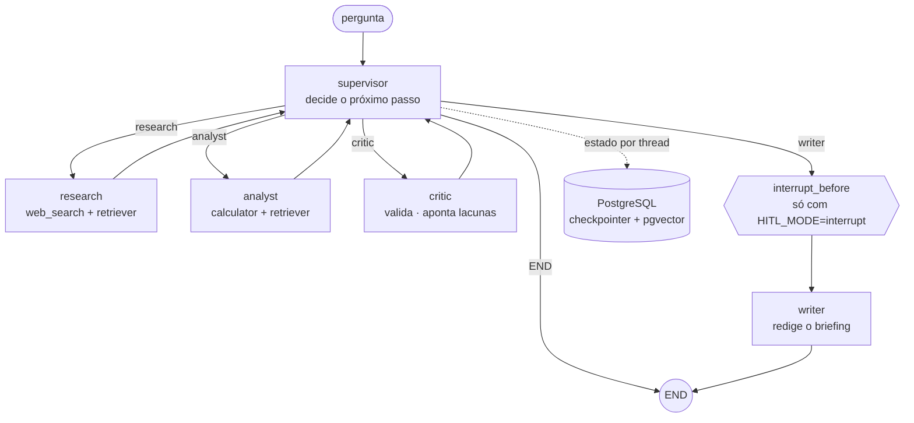

# Pauta

[](https://github.com/btaguiar/pauta/actions/workflows/ci.yml)

```
Multi-agent analytical briefings with LangGraph: dynamic supervision,
a bounded critic loop, human-in-the-loop interrupts and a token budget.
```

Perguntas analíticas não cabem numa cadeia linear. "Vale a pena migrar de API por
token para GPU dedicada?" precisa de busca, de conta, de alguém conferindo o que
foi reunido, e de um texto que diga o que não deu para validar.

O Pauta decompõe a pergunta, delega cada etapa a um agente especializado, valida
o resultado com um crítico e redige um briefing com a fonte em cada afirmação.
*Pauta* é a palavra de redação brasileira para essa encomenda: a pergunta, as
fontes a checar, e quem revisa.

## A prova: a run sobrevive à morte do processo

O que a maioria dos repositórios de agente chama de "execução durável" é testado
com um checkpointer em memória, que morre junto com o processo e não prova nada.

Aqui um teste sobe um processo filho de verdade, espera ele chegar ao writer,
manda `kill()` sem handler nenhum, e então, em processo novo, lê o checkpoint no
Postgres:

```python
assert snapshot.values["task"] == "sobreviver ao kill"
assert [f.content for f in snapshot.values["findings"]] == ["descoberta antes da morte"]
assert snapshot.values["critiques"][0].verdict == "ok"
assert snapshot.values.get("final_report") is None   # o writer não terminou
assert snapshot.next == ("writer",)                  # e é de lá que ele retoma
```

Depois retoma pelo mesmo `thread_id` e conclui o briefing.

Está em [tests/test_durability_kill.py](tests/test_durability_kill.py), com o
drain cooperativo ao lado em [tests/test_durability.py](tests/test_durability.py).
O job `durabilidade` do [CI](.github/workflows/ci.yml) sobe um Postgres de
verdade e roda os dois em todo push, sem condicional: prova que só roda quando
alguém lembra não é prova.

Pela linha de comando, o mesmo mecanismo é `--list` e `--resume`.

> Falta aqui um GIF de 20 segundos mostrando isso ao vivo. Ele depende de uma
> execução real, e nenhuma combinação de modelos foi escolhida ainda.

## Números

Cinco execuções reais, em 2026-09-08, commit `23ce942`. É a primeira vez que o
sistema falou com um provider, então o `n` é pequeno e está dito em cada linha.

| o que | medido |
|---|---|
| briefing sobre o corpus, ponta a ponta | 12.406 tokens, 35s, 3 ciclos (n=1) |
| o mesmo com revisão humana no meio | 13.656 tokens, 4 ciclos (n=1) |
| tarefa-armadilha, com busca web | 80.728 tokens, 125s (n=1) |
| runs que terminaram | 3 de 5 |

O que essas cinco execuções já mostraram de errado, e vale mais que os acertos:
a tarefa-armadilha gastou 80.728 tokens contra um orçamento de 60.000, porque o
guardrail corta rodadas de tool e não interrompe a chamada em curso. Uma tarefa
cuja resposta não está no corpus fez o supervisor voltar ao research quatro
vezes até o orçamento acabar. E numa tarefa que exige conta, o supervisor nunca
passou pelo analyst, então a aritmética foi feita de cabeça, contra a regra do
prompt. Esse último foi o eval que pegou, no primeiro uso.

Nenhuma combinação de modelos foi comparada ainda: `eval/matrix.py` existe e
nunca rodou. O método, as definições e as limitações estão em
[EVALUATION.md](EVALUATION.md).

## O grafo



Cinco nós, um nível de supervisão. O supervisor decide por output estruturado, e
o código corrige a decisão dele antes de aplicá-la. As sete ADRs estão em
[ARCHITECTURE.md](ARCHITECTURE.md).

## Decisões que custaram alguma coisa

| decisão | por quê |
|---|---|
| Predicado de retry próprio, em vez do padrão | O `default_retry_on` do LangGraph retenta 5xx e recusa `ValueError`, mas não retenta 429. Rate limit precisa ser retentado e erro de schema não. [builder.py:31](src/pauta/graph/builder.py#L31) |
| Orçamento de tokens em duas camadas | Checar o contador só entre nós deixava a run passar de 60k, porque um nó de pesquisa gasta dezenas de milhares de uma vez. A checagem também acontece dentro do nó, entre rodadas de tool. [budget.py](src/pauta/graph/budget.py) |
| O LLM propõe a rota, o código dispõe | Limites impostos antes de consultar o modelo, regras reaplicadas depois da resposta, e rota determinística quando o parse falha duas vezes. [routing.py:47](src/pauta/graph/routing.py#L47) |
| Crítico que não responde reprova | Sem veredito, o material segue como não validado e a ressalva vai no briefing. Aprovar por omissão é o modo de falha que a ADR 002 existe para pegar. [critic.py:83](src/pauta/agents/critic.py#L83) |
| Um nível de supervisão, não hierarquia | Subgrafo e supervisor de supervisor só entram com justificativa medida no eval. ADR 001 |
| Nenhum modelo no código | Todo LLM sai de `get_model(role)`, inclusive o juiz do eval. Trocar de provider é editar o `.env`. ADR 007 |
| Qual combinação de modelos | **Pendente.** O instrumento existe em `eval/matrix.py`; a medição não foi feita. |

## Limitações conhecidas

- Nenhum número de qualidade foi medido. Ver a seção acima.
- O juiz de fidelidade está calibrado apenas contra 8 casos construídos para
  serem inequívocos. Um conjunto sem caso difícil superestima a concordância.
- `incerteza_sinalizada` é casamento de marcador de texto, não compreensão.
- O corpus tem 6 documentos e 22 chunks. Pequeno demais para generalizar.
- A API não faz streaming. O contrato prevê `GET /runs/{id}/stream` por SSE, e
  ele não existe, então a demo que mostraria os eventos ao vivo também não.
- O rate limit conta na memória do processo. Duas réplicas seriam dois
  limitadores, e o teto efetivo dobraria.
- O teto diário só protege quando `COST_PER_MTOK_USD` está preenchido. Vazio,
  `GET /health` responde `budget_enforceable: false`, e é literalmente isso.
- A busca web depende da Tavily. Sem `TAVILY_API_KEY`, o research fica só com o
  corpus local.

## Rodar

Tudo em container, que é o caminho de quem só quer ver funcionando:

```
cp .env.example .env      # preencha OPENROUTER_API_KEY e os três MODEL_*
docker compose up -d --build
docker compose run --rm index      # indexa samples/, opcional

curl -s localhost:8000/health
curl -s -X POST localhost:8000/runs \
  -H 'content-type: application/json' \
  -d '{"task": "vale a pena migrar de API por token para GPU dedicada?"}'
```

O `POST` responde 201 na hora com o `thread_id` e executa em segundo plano.
`GET /runs/{id}` traz o briefing, as descobertas, as críticas e o custo. O
teto diário e o rate limit por IP recusam com 503 e 429, com o motivo no corpo.

Pela linha de comando, sem container:

```
docker compose up -d postgres
uv sync
uv run python -m pauta "vale a pena migrar de API por token para GPU dedicada?"
```

A run é durável por padrão: checkpoint e ponteiro vão para o Postgres. Se o
processo cair no meio:

```
uv run python -m pauta --list                 # mostra o thread_id de cada run
uv run python -m pauta --resume THREAD_ID     # continua de onde parou
```

Com `HITL_MODE=interrupt` o grafo congela antes da redação e espera aprovação,
que chega pelo mesmo `--resume`, com `--feedback "foque no custo de saída"`
opcional. Para experimentar sem Postgres, `--ephemeral`.

Avaliação:

```
uv run python eval/run_eval.py --limit 5 --repeats 1
uv run python eval/calibrate_judge.py
uv run python eval/matrix.py
```

## Corpus de exemplo

O retriever indexa apenas o que está em [samples/](samples/). Hoje são 6
documentos, que geram 22 chunks de até 800 tokens com 100 de sobreposição,
medidos e não estimados. Três vêm da Wikipédia em português, sob CC BY-SA 4.0.
Três foram escritos para o projeto, com números fictícios, porque o conjunto de
avaliação precisa de casos que documentação pública não oferece sob medida.
A origem de cada um está em [samples/SOURCES.md](samples/SOURCES.md).
